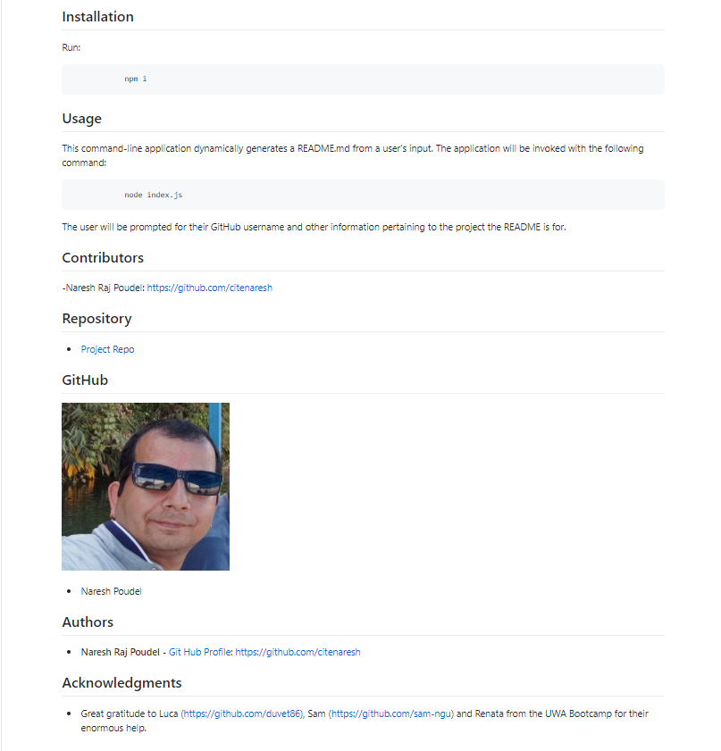

# **Good README Generator**

## Description 

When creating an open source project on GitHub, it is important to have a quality README with information about the app--what is the app for, how to use the app, how to install it, how to report issues, and how to make contributions so that other developers are more likely to use and contribute to the success of the project. A command-line application will allow for quick and easy generation of a project README to get started quickly. This will allow a project creator to spend more time working on finishing the project and less time creating a good README.   

### App working example

 
[Video Link](https://drive.google.com/file/d/1MH7s1ca_zFVhzdlb2lKQJ6eUQD7mno0M/view?usp=sharing)

### README example

## Table of contents

- [Description](#Description)
- [Installation](#Installation)
- [Usage](#Usage)
- [Contributors](#Contributors)
- [Repository Link](#Repository)
- [GitHub Info](#GitHub) 
- [Authors](#Authors)
- [Acknowledgments](#Acknowledgments)

## Installation
Run:

                npm i

## Usage

This command-line application dynamically generates a README.md from a user's input. The application will be invoked with the following command:

                node index.js

The user will be prompted for their GitHub username and other information pertaining to the project the README is for.

## Contributors

-Naresh Raj Poudel: https://github.com/citenaresh

## Repository

-* [GitHub Repository](https://github.com/citenaresh/README_Generator/): https://github.com/citenaresh/README_Generator/

## GitHub

- Naresh Poudel

## Authors

* **Naresh Raj Poudel** - [Git Hub Profile](https://github.com/citenaresh): https://github.com/citenaresh

## Acknowledgments

* Great gratitude to Luca ([https://github.com/duvet86](https://github.com/duvet86)), Sam ([https://github.com/sam-ngu](https://github.com/sam-ngu)) and Renata from the UWA Bootcamp for their enormous help.
